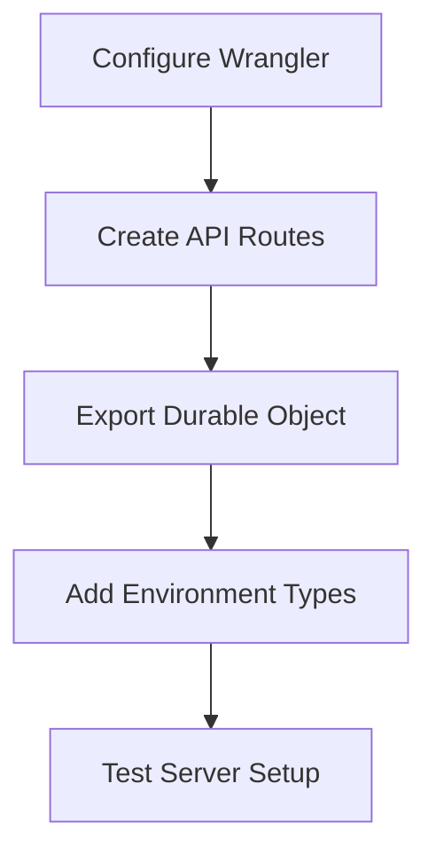
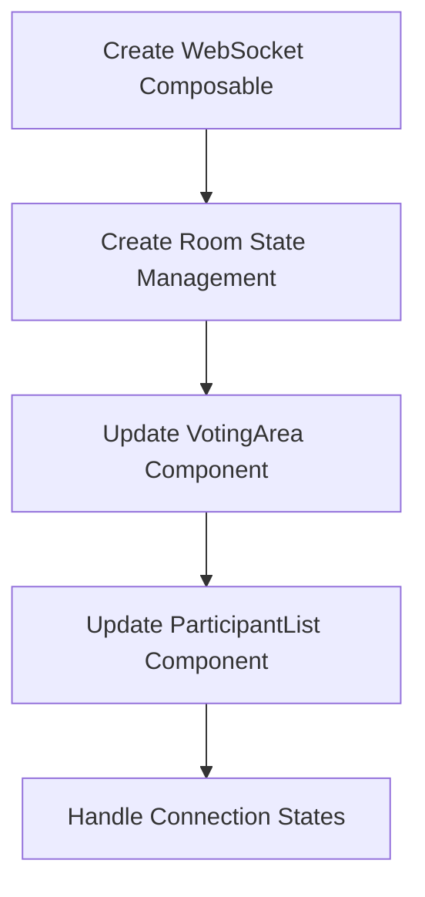
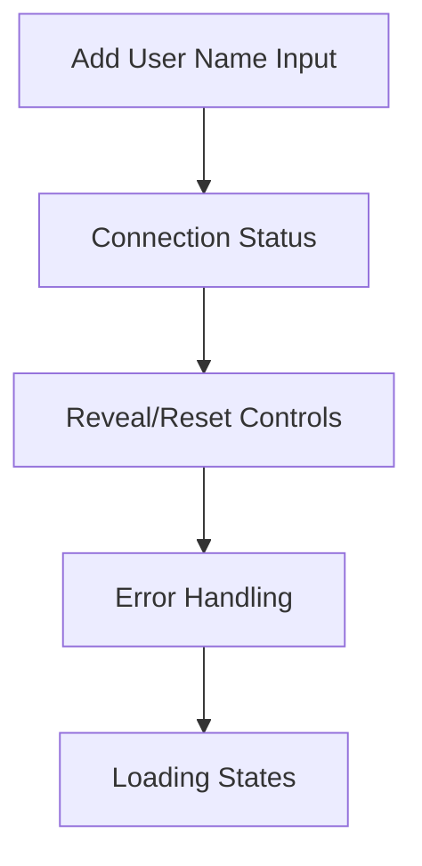
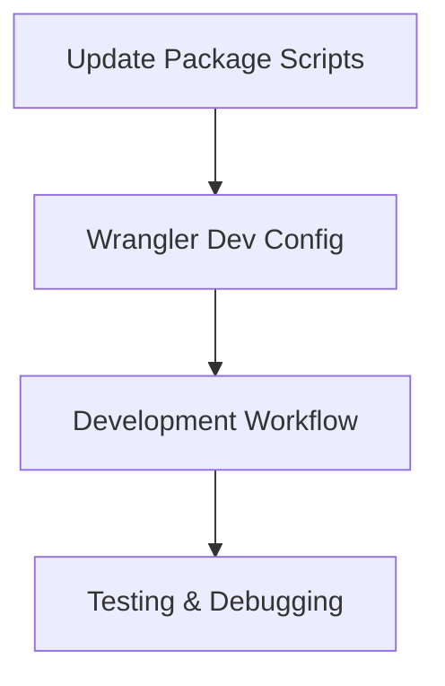
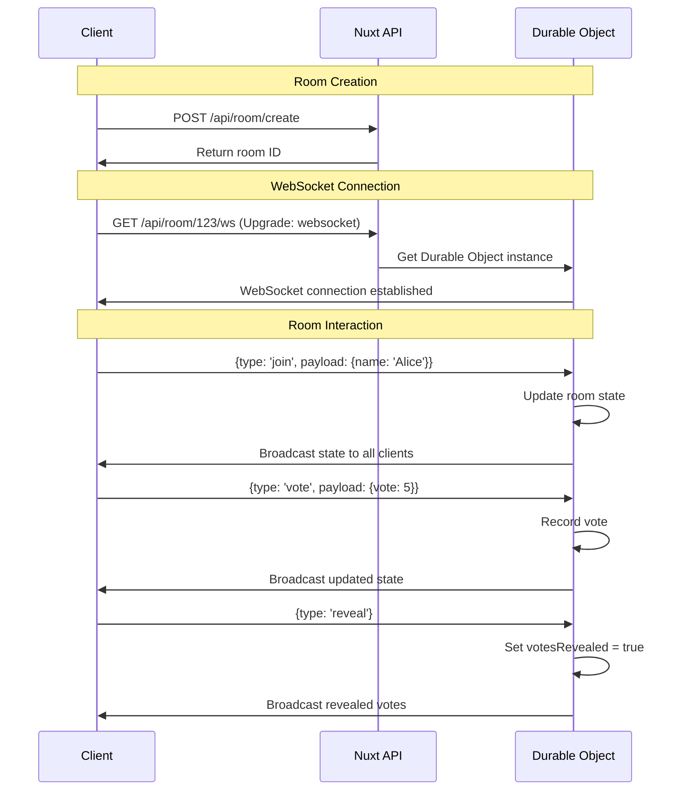
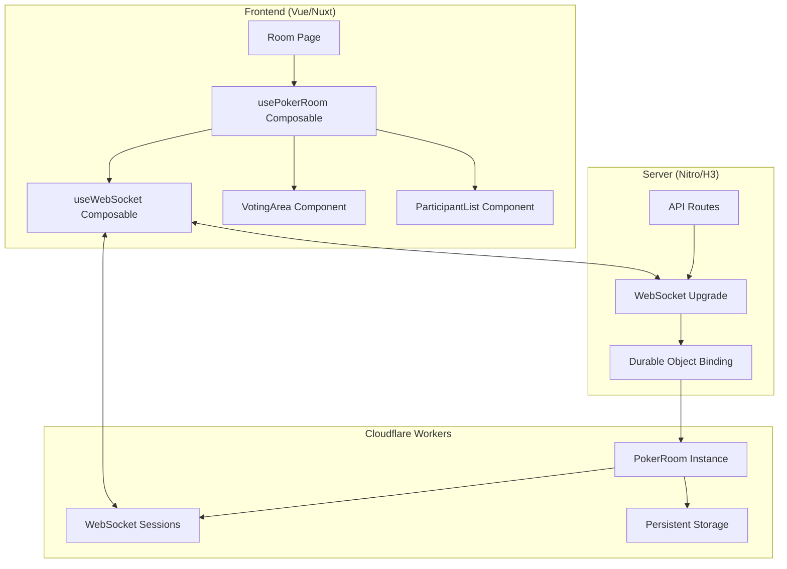

# Planning Poker Implementation Plan

## Current State Analysis

### ✅ What You Have (Solid Foundation)

- **Well-structured PokerRoom Durable Object** ([`server/lib/PokerRoom.ts`](server/lib/PokerRoom.ts))
  - Proper WebSocket handling and session management
  - Complete message type definitions (`join`, `vote`, `reveal`, `reset`)
  - State persistence with Durable Object storage
  - Real-time broadcasting to all participants
- **Complete Vue Components** with Tailwind CSS styling
  - [`components/Card.vue`](components/Card.vue) - Interactive voting cards
  - [`components/VotingArea.vue`](components/VotingArea.vue) - Main voting interface
  - [`components/ParticipantList.vue`](components/ParticipantList.vue) - Participant display
  - [`pages/room/[id].vue`](pages/room/[id].vue) - Room layout
  - [`pages/index.vue`](pages/index.vue) - Landing page with room creation
- **Proper Project Structure**
  - Nuxt 3 setup with TypeScript
  - Cloudflare Workers configuration ([`nuxt.config.ts`](nuxt.config.ts))
  - Package management with pnpm

### ❌ Critical Missing Pieces

1. **Server-Side Integration Gap**

   - Durable Object exists but isn't connected to Nuxt application
   - No server routes to handle WebSocket upgrades
   - Missing Durable Object bindings in [`wrangler.jsonc`](wrangler.jsonc)

2. **Frontend Real-Time Communication**

   - Components use static mock data
   - No WebSocket client implementation
   - No reactive state management for room data

3. **API Layer Missing**

   - No room creation endpoint
   - No WebSocket upgrade handling
   - No connection between frontend and Durable Objects

4. **Development Workflow**
   - Local development setup incomplete
   - Missing debugging capabilities for WebSocket connections

## Implementation Plan

### Phase 1: Server Integration & Configuration 🔧



#### Tasks:

1. **Update [`wrangler.jsonc`](wrangler.jsonc)**

   - Add Durable Object bindings
   - Configure proper script exports

   ```json
   {
     "durable_objects": {
       "bindings": [
         {
           "name": "POKER_ROOM",
           "class_name": "PokerRoom",
           "script_name": "planning-poker"
         }
       ]
     }
   }
   ```

2. **Create [`server/api/room/create.post.ts`](server/api/room/create.post.ts)**

   - Handle room creation requests
   - Generate unique room IDs
   - Return room metadata

3. **Create [`server/api/room/[id]/ws.ts`](server/api/room/[id]/ws.ts)**

   - Handle WebSocket upgrade requests
   - Route to appropriate Durable Object instance
   - Manage room-specific connections

4. **Create [`server/index.ts`](server/index.ts)**

   - Export PokerRoom Durable Object for Workers runtime
   - Configure proper module exports

5. **Update [`worker-configuration.d.ts`](worker-configuration.d.ts)**
   - Add environment type definitions
   - Include Durable Object bindings

### Phase 2: Frontend Real-Time Integration 🔌



#### Tasks:

1. **Create [`composables/useWebSocket.ts`](composables/useWebSocket.ts)**

   - WebSocket connection management
   - Automatic reconnection logic
   - Message sending/receiving utilities
   - Connection state tracking

2. **Create [`composables/usePokerRoom.ts`](composables/usePokerRoom.ts)**

   - Room state management (participants, votes, reveal status)
   - Integration with WebSocket composable
   - Reactive state updates
   - Action methods (join, vote, reveal, reset)

3. **Update [`components/VotingArea.vue`](components/VotingArea.vue)**

   - Connect to real-time room state
   - Send vote messages via WebSocket
   - Display current story title from room state
   - Handle voting state changes

4. **Update [`components/ParticipantList.vue`](components/ParticipantList.vue)**

   - Display real participants from room state
   - Show actual vote status (voted/not voted)
   - Reveal votes when appropriate
   - Handle participant join/leave events

5. **Update [`pages/room/[id].vue`](pages/room/[id].vue)**
   - Initialize WebSocket connection on mount
   - Handle room joining flow
   - Manage connection errors and loading states

### Phase 3: User Experience Enhancements 🎨



#### Tasks:

1. **Create [`components/UserNameModal.vue`](components/UserNameModal.vue)**

   - Simple name input dialog
   - Validation and guest name generation
   - Integration with room joining

2. **Add Connection Status Indicators**

   - Online/offline status display
   - Connection quality indicators
   - Reconnection progress

3. **Create [`components/RoomControls.vue`](components/RoomControls.vue)**

   - Reveal votes button
   - Reset round button
   - Room moderator actions

4. **Implement Error Handling**

   - Connection failure messages
   - Invalid room handling
   - WebSocket error recovery

5. **Add Loading States**
   - Room connection loading
   - Vote submission feedback
   - Participant action indicators

### Phase 4: Local Development Setup 🧪



#### Tasks:

1. **Update [`package.json`](package.json) Scripts**

   - Add proper dev script with Wrangler
   - Local development with Durable Objects
   - Build and preview commands

2. **Development Workflow Setup**

   - Local Wrangler configuration
   - Hot reload with WebSocket connections
   - Debugging capabilities

3. **Testing Setup**
   - Room creation and joining flow
   - Multi-user voting scenarios
   - Connection handling edge cases

## Technical Architecture

### Message Flow



### Data Flow Architecture



## Implementation Priority

### 🚨 Critical Path (Must implement first)

1. **Wrangler Configuration** - Enables Durable Object binding
2. **WebSocket API Route** - Connects frontend to backend
3. **WebSocket Composable** - Enables real-time communication

### 🔄 Core Functionality (Implement next)

4. **Room State Management** - Reactive state handling
5. **Component Updates** - Connect UI to real data
6. **User Name Input** - Basic user identification

### ✨ Polish & UX (Implement last)

7. **Error Handling** - Robust error states
8. **Loading States** - Better user feedback
9. **Room Controls** - Reveal/reset functionality

## File Structure After Implementation

```
planning-poker/
├── server/
│   ├── api/
│   │   └── room/
│   │       ├── create.post.ts          # Room creation endpoint
│   │       └── [id]/
│   │           └── ws.ts               # WebSocket upgrade handler
│   ├── lib/
│   │   └── PokerRoom.ts               # ✅ Existing Durable Object
│   └── index.ts                       # Worker exports
├── composables/
│   ├── useWebSocket.ts                # WebSocket connection management
│   └── usePokerRoom.ts                # Room state management
├── components/
│   ├── Card.vue                       # ✅ Existing
│   ├── VotingArea.vue                 # ✅ Update for real-time
│   ├── ParticipantList.vue            # ✅ Update for real-time
│   ├── UserNameModal.vue              # New: Name input
│   └── RoomControls.vue               # New: Reveal/reset buttons
├── pages/
│   ├── index.vue                      # ✅ Existing landing page
│   └── room/
│       └── [id].vue                   # ✅ Update for WebSocket
├── wrangler.jsonc                     # ✅ Update with DO bindings
└── worker-configuration.d.ts          # ✅ Update with types
```

## Success Criteria

### Phase 1 Complete ✅

- [x] Wrangler properly configured with Durable Object bindings
- [x] WebSocket upgrade endpoint functional
- [x] Room creation API working
- [x] Local development server running with Durable Objects

### Phase 2 Complete ✅

- [x] WebSocket connection established from frontend
- [x] Real-time voting functionality working
- [x] Participant list updates in real-time
- [x] Vote reveal/reset functionality operational

### Phase 3 Complete ✅

- [ ] User name input on room join
- [ ] Connection status indicators
- [ ] Error handling for common scenarios
- [ ] Smooth loading states throughout app

### Phase 4 Complete ✅

- [ ] Reliable local development workflow
- [ ] Multi-user testing successful
- [ ] Ready for deployment to Cloudflare Workers

## Next Steps

1. **Start with Phase 1** - Server integration is the critical blocker
2. **Test incrementally** - Verify each phase before moving to next
3. **Focus on core functionality** - Skip authentication as requested
4. **Prepare for deployment** - Ensure local development works first

This plan transforms your solid foundation into a fully functional real-time planning poker application by connecting the existing Durable Object backend with the Vue frontend through proper WebSocket integration.
